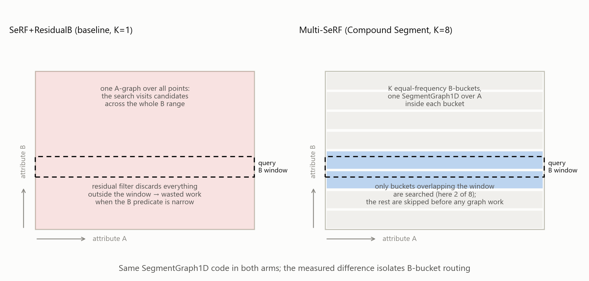
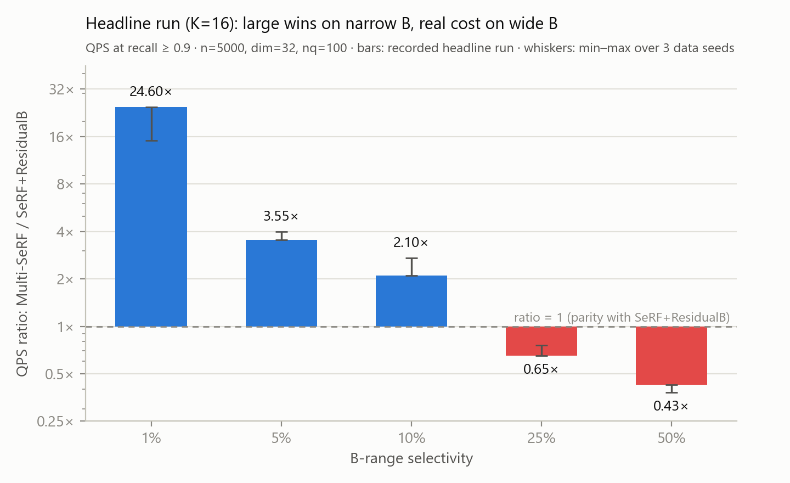
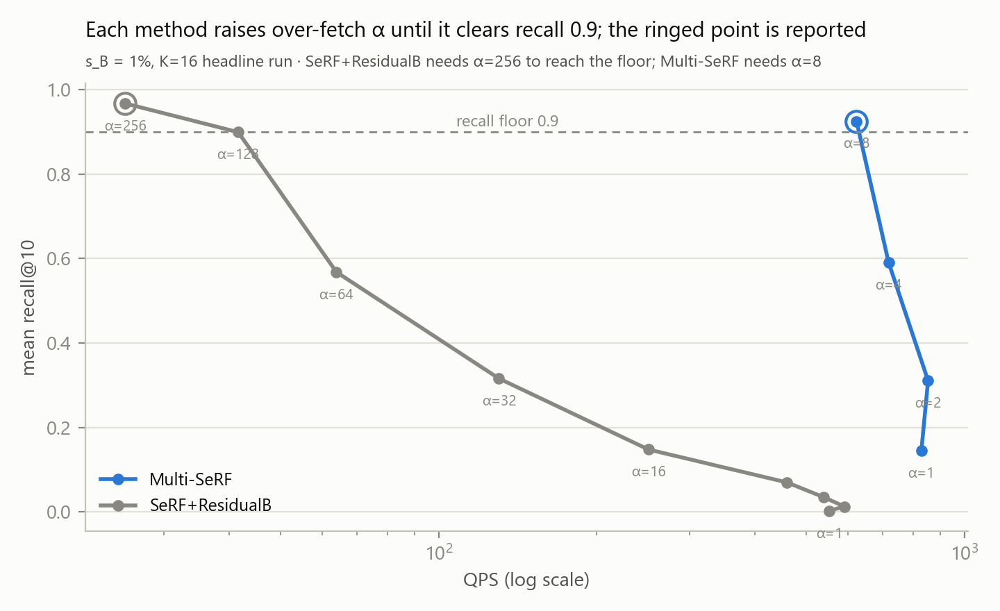
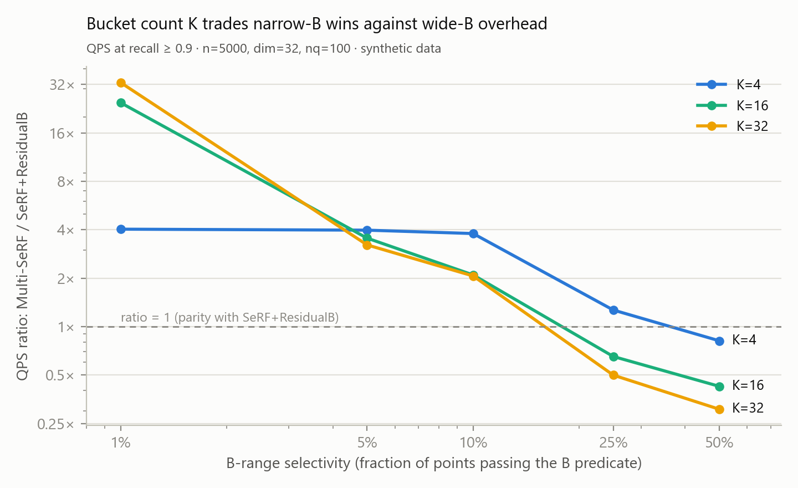
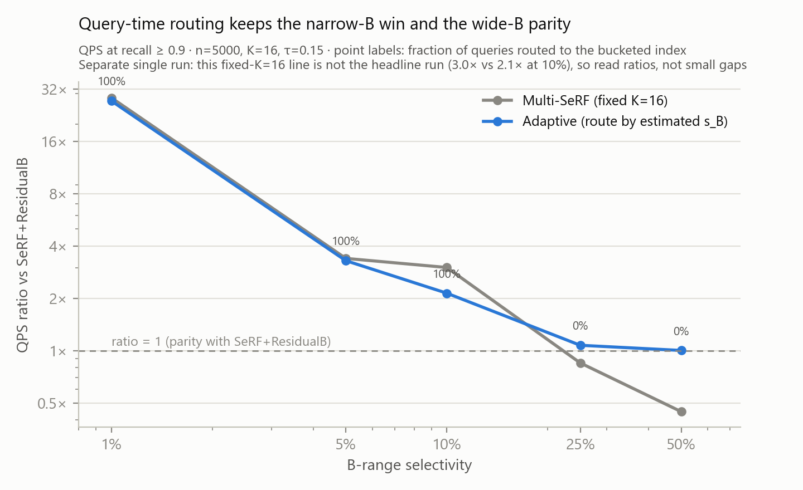

# Multi-SeRF Prototype: Multi-Attribute Range-Filtered ANN

This is a standalone Python prototype for **Multi-SeRF**, a Compound Segment
approach for vector similarity search with multiple range predicates.

The project answers one focused question:

> If a vector search query has range predicates on both `A` and `B`, can we
> reduce wasted post-filtering by partitioning the data on `B` and only
> searching buckets whose `B` range overlaps the query?

The answer from this prototype is: **yes, when the `B` predicate is selective**.
On synthetic data, Multi-SeRF reaches the recall floor while improving QPS over
the `SeRF+ResidualB` baseline by 15–25x at 1% `B` selectivity and 3.5–4x at 5%
(range over three data seeds), and the advantage grows with n. A query-adaptive
router on top removes the wide-window penalty entirely.

**Quick start**:

```bash
py -3 demo.py       # ~30 s narrated demo of the routing mechanism (needs only numpy)
py -3 sql_demo.py   # filtered k-NN in DuckDB SQL (additionally needs duckdb and pandas)
```

## Why This Matters

Approximate nearest-neighbor (ANN) indexes are good at vector similarity, but
database workloads usually combine vector search with structured filters. A
simple post-filter strategy can waste work: the ANN search may visit many
vectors that later fail the filter.

This prototype focuses on the case where a query has two ordered range
predicates:

```text
nearest vectors to q
where A between a_lo and a_hi
  and B between b_lo and b_hi
```

The baseline uses a single SeRF-style graph for `A` and applies `B` as a
residual filter after graph traversal. Multi-SeRF instead partitions by `B`, so
it can skip unrelated buckets before graph search.

## Approach



Multi-SeRF uses a **Compound Segment** layout:

1. Sort data by secondary attribute `B`.
2. Partition the data into `K` equal-frequency `B` buckets.
3. Build one simplified SeRF-style `SegmentGraph1D` over attribute `A` inside
   each bucket.
4. For a query, search only buckets whose `B` range overlaps `[b_lo, b_hi]`.
5. Merge candidates and rerank by exact vector distance.

This is **not** a full SeRF reimplementation. The per-bucket graph is a
deliberately simplified, SeRF-inspired `SegmentGraph1D`. The important
experimental control is that both Multi-SeRF and the `SeRF+ResidualB` baseline
share the same graph implementation, so their QPS/recall difference isolates
the value of `B`-bucket routing.

## Headline Results

Main run: `n=5000`, `dim=32`, `nq=100`, `K=16`, recall floor `0.9`, synthetic
Gaussian vectors with independent uniform attributes.

| B selectivity | SeRF+ResidualB QPS | Multi-SeRF QPS | Ratio |
|---:|---:|---:|---:|
| 1% | 25.4 | 623.6 | 24.6x |
| 5% | 142.8 | 506.4 | 3.55x |
| 10% | 154.3 | 323.3 | 2.10x |
| 25% | 300.8 | 196.1 | 0.65x |
| 50% | 281.8 | 119.8 | 0.43x |



"QPS at recall ≥ 0.9" means each method raises its over-fetch multiplier `α`
until mean recall clears 0.9, and the QPS at that smallest `α` is reported.
The narrow-B gap is exactly this: the baseline needs `α=128–256` to survive
residual-B filtering, Multi-SeRF needs `α=8`:



Interpretation:

- Narrow `B` predicates are the winning case. Multi-SeRF skips most buckets and
  avoids large residual-filter waste.
- Wide `B` predicates expose the cost of running multiple graph searches. When
  many buckets overlap, the single baseline graph can be faster.
- The bucket count `K` is the main design trade-off: larger `K` improves narrow
  `B` queries but hurts wide `B` queries.

The K trade-off across the K=4 / K=16 / K=32 runs:



The crossover point (ratio = 1) moves with `K`: roughly 40% B selectivity for
K=4 versus roughly 13% for K=16 and K=32. No single `K` wins everywhere; the
right `K` depends on the expected `B` selectivity of the workload.

### Resolving the trade-off: adaptive routing

The K trade-off does not have to be resolved at build time. `AdaptiveIndex`
keeps both the K=1 graph and the K=16 buckets (~2x edges) and routes each
query by a free B-selectivity estimate from bucket boundaries: narrow windows
go to the buckets, wide windows to the single graph.



With τ=0.15 on the main config, adaptive routing keeps the narrow-B win
(27x at 1%) **and** wide-B parity (1.00x at 50%) — the first configuration in
which both of the proposal's success criteria hold simultaneously. See
`results.md` §10.

### Robustness checks

| check | result |
|---|---|
| 3 data seeds (main config) | 1% ratio spans 15.1–24.6x; 5% is a stable 3.5–4.0x. The 1% spread is grid-quantisation: the baseline needs `α=128` or `α=256` depending on seed, and the α grid doubles per step. The ≥2x criterion at `s_B ≤ 5%` holds on every seed. |
| B correlated with vectors (`--b-corr 0.8`, rank corr ≈ 0.78) | 14.5x / 3.8x / 2.8x / 0.76x / 0.41x — inside the seed-variance envelope; no degradation observed at this correlation strength. |
| Real vectors: SIFT10K (128-d, corpus queries) | With M=32/ef_build=200, the pattern reproduces: **14.7x** at 1%, 3.6x at 5%, crossover ~10–12%. Honest catch: at the default M=16 build, *neither* arm reaches recall 0.9 on real clustered vectors — the simplified graph needs stronger build parameters off synthetic data (both runs kept). |
| n = 20,000 (single run, nq=50) | Advantage grows across the board: 15.5x / 11.2x / 6.5x / 2.9x / 0.85x. The crossover moves past 25% B selectivity. |
| n = 100,000 (single run, nq=50) | At 1–5%, Multi-SeRF clears recall 0.9 while the baseline does not at the tested α cap (512) — the 22.5x/25.1x ratios there compare against the baseline's best sub-floor point. At 10–50%, both clear recall 0.9 and Multi-SeRF is faster: 17.3x / 8.6x / **5.0x at 50%**. The wide-B penalty is a small-n artifact. |

See `results.md` §9–12 for the full tables and the honest caveats on each check.

See `results.md` for the full write-up, caveats, and K-sensitivity tables.

## Files

| file | what |
|---|---|
| `design_notes.md` | architecture, simplified segment graph, isolation argument, scope and limits |
| `multiserf_proto.py` | `SegmentGraph1D`, `CompoundSegment`, `AdaptiveIndex`, ground truth and recall helpers |
| `run_experiments_partB.py` | experiment runner for B-selectivity sweeps and QPS-at-recall measurement |
| `run_adaptive.py` | adaptive-routing experiment: K=1 vs K=16 vs query-time routing |
| `run_adaptive_tau_sweep.py` | routing-threshold sensitivity: τ ∈ {0.05…0.50} vs the same baselines |
| `run_mixed_workload.py` | mixed-selectivity stream, one shared α per index (K=1/4/16/adaptive) |
| `demo.py` | ~30 s quick demo: build both indexes, watch the routing on 3 window widths |
| `sql_demo.py` | DuckDB scalar-UDF demo: the index answering a filtered k-NN question in SQL |
| `test_sanity.py` | sanity tests: `recall_at_k` semantics; K=1 equals the baseline path; predicate safety; adaptive routing |
| `make_figures.py` | regenerates `figures/*.png` from the existing result JSON files |
| `figures/` | result figures used in this README |
| `results.md` | full result analysis, caveats, and success-criteria discussion |
| `requirements.txt` | numpy (runtime); matplotlib / pytest (optional tooling) |
| `results_partB_main.json` | headline run: K=16, full A range |
| `results_partB_K4.json`, `results_partB_K32.json` | bucket-count sensitivity runs |
| `results_partB_arestrict.json` | restrictive A-range run |
| `results_partB_seed1.json`, `results_partB_seed2.json` | data-seed variance reruns of the main config |
| `results_partB_bcorr.json` | correlated-B run (`--b-corr 0.8`) |
| `results_partB_n20k.json` | n=20,000 scale check (nq=50) |
| `results_partB_n100k.json` | n=100,000 scale check (nq=50) |
| `results_partB_adaptive.json` | adaptive-routing run (K=1 / K=16 / adaptive) |
| `results_partB_adaptive_tau.json` | τ sensitivity: adaptive holds for τ ∈ [0.10, 0.25] |
| `results_partB_mixed_workload.json` | mixed workload: adaptive gives the best stream throughput |
| `results_partB_sift.json` | SIFT10K, default M=16 build (recall floor not reached — kept as a negative finding) |
| `results_partB_sift_M32.json` | SIFT10K, M=32/ef_build=200 (headline pattern reproduces) |
| `results_partB_smoke.json` | small smoke run |
| `` | captured stdout for recorded experiments |
| `data/` | auto-downloaded datasets (siftsmall); not committed |

## How to Run

Requires `numpy`. No other runtime dependency is required; `SegmentGraph1D` is
hand-rolled.

```bash
# headline: B-selectivity sweep, K=16 buckets, full A range
py -3 run_experiments_partB.py --n 5000 --dim 32 --nq 100 --K 16 --out results_partB_main.json

# bucket-count sensitivity
py -3 run_experiments_partB.py --n 5000 --dim 32 --nq 100 --K 4  --out results_partB_K4.json
py -3 run_experiments_partB.py --n 5000 --dim 32 --nq 100 --K 32 --out results_partB_K32.json

# restrictive A range: A predicate selectivity 25%
py -3 run_experiments_partB.py --n 5000 --dim 32 --nq 100 --K 16 --a-sel 0.25 --out results_partB_arestrict.json

# robustness: other data seeds, correlated B, larger n
py -3 run_experiments_partB.py --n 5000 --dim 32 --nq 100 --K 16 --seed 1 --out results_partB_seed1.json
py -3 run_experiments_partB.py --n 5000 --dim 32 --nq 100 --K 16 --b-corr 0.8 --out results_partB_bcorr.json
py -3 run_experiments_partB.py --n 20000 --dim 32 --nq 50 --K 16 --out results_partB_n20k.json
py -3 run_experiments_partB.py --n 100000 --dim 32 --nq 50 --K 16 --out results_partB_n100k.json

# real vectors: SIFT10K (auto-downloads ~5 MB into data/)
py -3 run_experiments_partB.py --dataset siftsmall --nq 100 --K 16 --out results_partB_sift.json

# adaptive routing (K=1 vs K=16 vs query-time routing)
py -3 run_adaptive.py --n 5000 --dim 32 --nq 100 --K 16 --tau 0.15 --out results_partB_adaptive.json

# quick demos
py -3 demo.py        # ~30 s narrated demo
py -3 sql_demo.py    # DuckDB UDF demo (pip install duckdb)

# quick smoke
py -3 run_experiments_partB.py --n 1000 --dim 16 --nq 20 --K 8 --out results_partB_smoke.json
```

Key flags:

| flag | meaning |
|---|---|
| `--K` | bucket count for Multi-SeRF; K=1 is the SeRF+ResidualB baseline |
| `--a-sel` | A-range selectivity; 1.0 means full A range |
| `--b-sweep` | B-selectivity grid |
| `--b-corr` | correlation of B with the vectors; 0.0 = independent (default) |
| `--dataset` | `synthetic` (default) or `siftsmall` (real SIFT10K vectors + corpus queries) |
| `--seed` | data seed (query seed is independent and fixed) |
| `--n`, `--dim`, `--nq`, `--k` | synthetic dataset and query settings |

### Tests and figures

```bash
# sanity tests (fast; needs pytest)
py -3 -m pytest test_sanity.py -q

# regenerate figures/*.png from the recorded results_partB_*.json (needs matplotlib)
py -3 make_figures.py
```

The tests pin what the experiment's validity rests on: `recall_at_k` measures
against the achievable truth set, `CompoundSegment` K=1 reduces exactly to the
SeRF+ResidualB baseline path, and no query result ever violates the range
predicates. The figure script only reads the recorded JSON files; it never
reruns experiments.

## What Is Supported

- The main success criterion is met: Multi-SeRF is at least 2x faster than
  SeRF+ResidualB for narrow `B` ranges (`s_B <= 5%`) while reaching recall 0.9
  — and this holds on all three data seeds tested and with B correlated to the
  vectors.
- The bucket-routing mechanism is isolated because Multi-SeRF and the baseline
  use the same `SegmentGraph1D` code.
- The K trade-off is quantified with K=4, K=16, and K=32 runs — and then
  resolved at query time: the adaptive router meets **both** success criteria
  simultaneously (27x at 1%, 1.00x at 50%).
- A restrictive A-range run exercises both A filtering and B bucket routing.
- The pattern reproduces on real SIFT10K vectors (with a stronger graph build).
- Scale runs at n=20k and n=100k show the advantage growing with n. At n=100k,
  Multi-SeRF is faster wherever both arms reach recall 0.9 (10–50%), and at
  1–5% it clears the floor while the baseline cannot at the tested α cap.

## Limitations

- This is a single-thread Python research prototype, not a production vector
  database. A NumPy-vectorisation attempt on the query loop measured *slower*
  (small per-node edge lists); scaling past n≈100k needs a compiled kernel,
  which is out of scope (results.md §12).
- Real vectors were tested once (SIFT10K), and only reached the recall floor
  after retuning build parameters (M=32, ef_build=200) — the default M=16
  graph under-connects on clustered real data. Attributes remain synthetic
  everywhere; no dataset with natural attributes was used.
- Only the main configuration has multi-seed variance data (3 seeds); the K
  sweeps, A-restrict, adaptive, SIFT, and larger-n runs are single runs.
- `SegmentGraph1D` is SeRF-inspired but not a faithful SeRF-2D implementation.
- Absolute QPS should not be compared to production ANN systems. The meaningful
  evidence is the like-for-like ratio between Multi-SeRF and SeRF+ResidualB.
- The wide-B penalty at n=5k (0.4x at 50%) fades with scale (0.85x at n=20k,
  5.0x at n=100k) and is removed at any scale by the adaptive router; but the
  n=1M+ regime where SeRF-class methods are usually evaluated remains untested.
- The adaptive router's threshold τ is workload- and scale-dependent and was
  set from the measured n=5k crossover, not learned.
- `sql_demo.py` is a scalar-UDF demo, not a DBMS integration: no extension,
  persistence, or planner hook.

## Portfolio Summary

One-sentence version:

> Built a Python prototype for multi-attribute range-filtered vector search:
> `B`-bucket routing improves QPS by 15–25x over a residual-filter baseline at
> 1% secondary-predicate selectivity (recall ≥ 0.9; 3 seeds, real SIFT vectors,
> growing with n up to 100k), and a query-adaptive router removes the
> wide-window penalty, meeting both of the proposal's success criteria at once.

Best way to present the project:

- Lead with the multi-filter vector search problem.
- Explain the `B`-bucket routing idea visually or with a small diagram.
- Show the QPS ratio table and the K trade-off.
- Be explicit that this is a prototype with synthetic data and shared-code
  baselines, not a complete DBMS integration.
